<div align="center">

<!-- Animated Wave Header -->


<!-- Typing Animation -->
<a href="https://ai-mastery-roadmap.netlify.app/">
  
</a>

<br/>

<!-- Badges -->
[](https://ai-mastery-roadmap.netlify.app/)
[](https://github.com/prithvicoder1/Zero-to-AI-ML-Engineer/stargazers)
[](https://github.com/prithvicoder1/Zero-to-AI-ML-Engineer/network/members)
[](LICENSE)


</div>

---

## 🧠 About AIEngineerOS

**AIEngineerOS** is an all-in-one **interactive learning platform** built to guide aspiring AI Engineers from **zero to job-ready**, through structured roadmaps, quizzes, progress tracking, and real-world projects.

> 🎯 *Learn. Build. Track. Deploy.*

---

## ✨ Features

<table>
<tr>
<td width="50%">

### 🗺️ Structured Roadmaps
Step-by-step learning paths covering every stage of the AI/ML engineering journey.

### 🧩 Interactive Quizzes
Test your understanding as you progress through each module.

### 📊 Progress Tracking
Visual dashboards to track how far you've come.

</td>
<td width="50%">

### 🛠️ Real-World Projects
Apply what you learn through hands-on, portfolio-ready builds.

### 🚀 Deployment Ready
Learn Docker & MLOps to ship models like a pro.

### 🌐 Fully Interactive Web App
Built and deployed for instant access — no setup needed.

</td>
</tr>
</table>

---

## 🧭 Learning Path

```mermaid
graph LR
    A[🐍 Python] --> B[📐 Mathematics]
    B --> C[🤖 Machine Learning]
    C --> D[🧠 Deep Learning]
    D --> E[💬 NLP]
    E --> F[👁️ Computer Vision]
    F --> G[🔮 LLMs & RAG]
    G --> H[🔗 LangChain]
    H --> I[⚙️ MLOps & Docker]
    I --> J[🚀 Deployment]

    style A fill:#6C63FF,color:#fff
    style J fill:#00C9A7,color:#fff
```



---

## 📈 Roadmap Progress

| Module | Status | Progress |
|--------|--------|----------|
| 🐍 Python Foundations | ✅ Complete |  |
| 📐 Mathematics for ML | ✅ Complete |  |
| 🤖 Machine Learning | ✅ Complete |  |
| 🧠 Deep Learning | 🟡 In Progress |  |
| 💬 NLP & LLMs | 🟡 In Progress |  |
| 🔗 LangChain & RAG | 🔵 Upcoming |  |
| ⚙️ MLOps & Deployment | 🔵 Upcoming |  |

---

## 🖥️ Tech Stack

<div align="center">


</div>

---

## 🚀 Getting Started

```bash
# Clone the repository
git clone https://github.com/prithvicoder1/Zero-to-AI-ML-Engineer.git

# Move into the project directory
cd Zero-to-AI-ML-Engineer

# Open index.html in your browser
# (or use a live server extension in VS Code)
```

🔗 Or just visit the live site directly:
**[ai-mastery-roadmap.netlify.app](https://ai-mastery-roadmap.netlify.app/)**

---

## 🤝 Contributing

Contributions are welcome! Feel free to open issues or submit pull requests to help improve the roadmap, add resources, or fix bugs.

1. Fork the repo
2. Create your feature branch (`git checkout -b feature/amazing-feature`)
3. Commit your changes (`git commit -m 'Add amazing feature'`)
4. Push to the branch (`git push origin feature/amazing-feature`)
5. Open a Pull Request

---

## 📬 Connect

<div align="center">

[](https://github.com/prithvicoder1)

</div>

---

<div align="center">

### ⭐ If this roadmap helped you, consider giving it a star!


</div>
